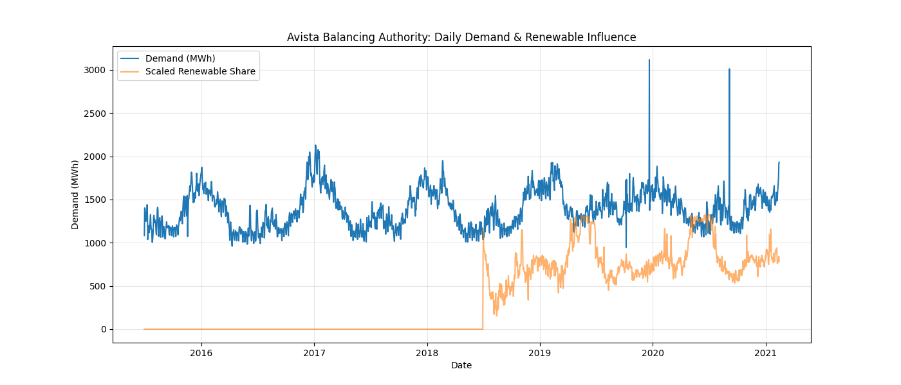
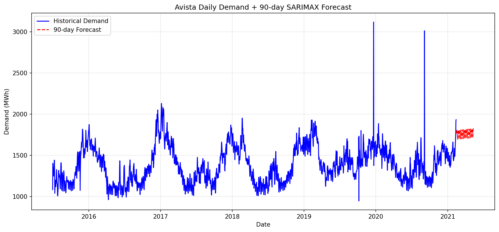

# Energy Risk Simulator

A Python-based quantitative risk modeling tool for electricity demand. It loads real hourly data from a U.S. balancing authority, forecasts loads using SARIMAX time series, runs Monte Carlo simulations for probabilistic scenario weighting, computes 95% Value at Risk (VaR), and recommends demand-response or hedging strategies.


## Overview

This tool:
- Processes real EIA hourly demand and generation data (Avista balancing authority)
- Forecasts future demand with seasonal SARIMAX (using temperature proxy + renewable share drivers)
- Simulates thousands of demand paths via Monte Carlo
- Calculates downside risk (95% VaR)
- Provides actionable risk recommendations
- Exports results and visualizations for stakeholders

Goal: Help energy teams answer questions like  
"What is the risk of demand shortfalls in the next 90 days, and when should we activate demand-response?"

## Skills Demonstrated
- Time-series forecasting (SARIMAX with exogenous variables)
- Probabilistic modeling (Monte Carlo simulation)
- Risk quantification (Value at Risk)
- Python (pandas, statsmodels, matplotlib, seaborn)
- Data visualization and reporting (plots + Excel export)
- Analytical and problem-solving skills (interpreting risk outputs for strategy)

## Data Source
- Hourly Balancing Authority data for Avista Corporation (AVA) from U.S. Energy Information Administration (EIA)
- Via Kaggle dataset: https://www.kaggle.com/datasets/antgoldbloom/us-eia-hourly-electricity-consumption
- Time period: ~2015-2021 (daily aggregated for modeling)

Note: Renewable generation data is sparse or zero in early years due to historical reporting gaps in public EIA data. The core demand forecasting and risk simulation remain reliable and business-relevant.

## Demo Outputs

### Historical Demand Trend & Renewable Influence (2015-2021)


 ###
Daily demand shows clear seasonal cycles - higher in winter (heating loads) and lower in summer - with noticeable year-to-year variability. The scaled renewable share (orange line) jumps sharply around 2019 and remains elevated, reflecting Avista's real-world growth in wind and solar.  
Business insight: Increasing renewable penetration post-2019 likely raises demand variability, creating opportunities for demand-response programs to manage peaks and intermittency.

### 90-Day SARIMAX Demand Forecast


 ###
The forecast (red dashed line) extends the historical seasonal pattern smoothly into the future, starting near the last observed level (~1,500-1,800 MWh/day). It remains relatively stable in the short term due to the model's mean-reversion and constant exogenous drivers.  
Business insight: Predictable seasonal demand supports proactive load management, but Monte Carlo risk layers would reveal tail risks during high-demand periods.

## Sample Risk Report
[Download ava_risk_report.xlsx](ava_risk_report.xlsx)  
(Sheets: Cleaned_Data, Forecast, Risk_Metrics)

## How to Run
1. Clone the repo
2. Install dependencies:
   ```bash
   pip install pandas numpy statsmodels matplotlib seaborn openpyxl
